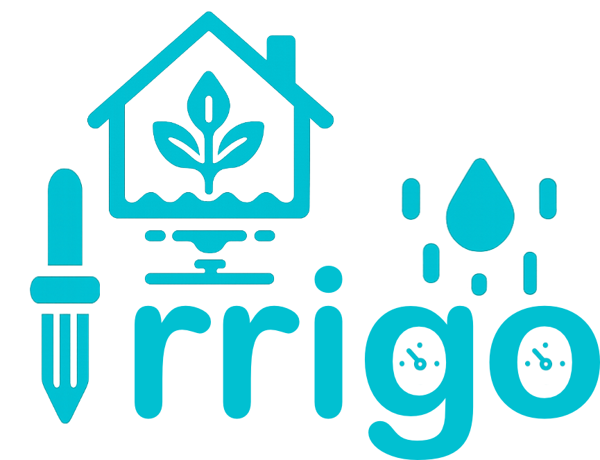
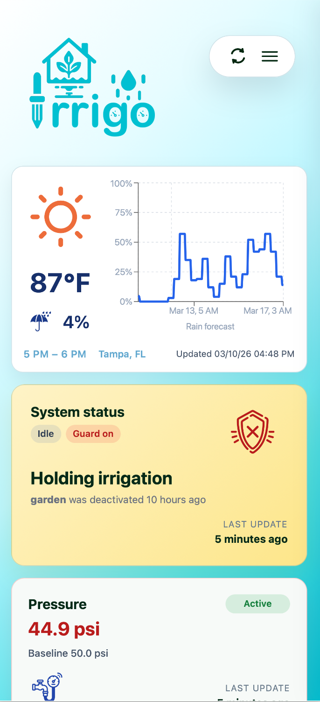
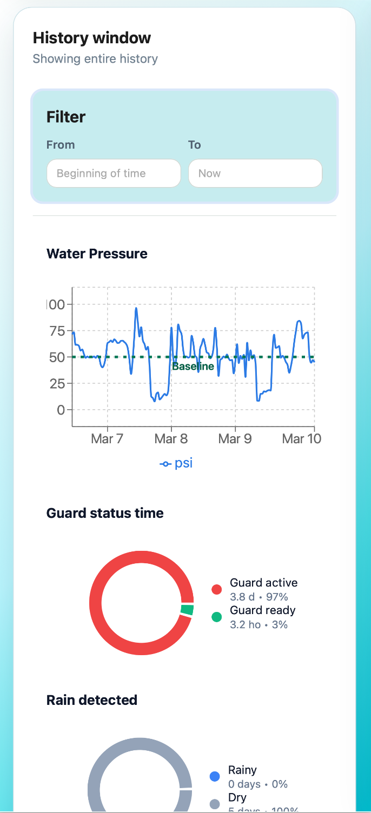
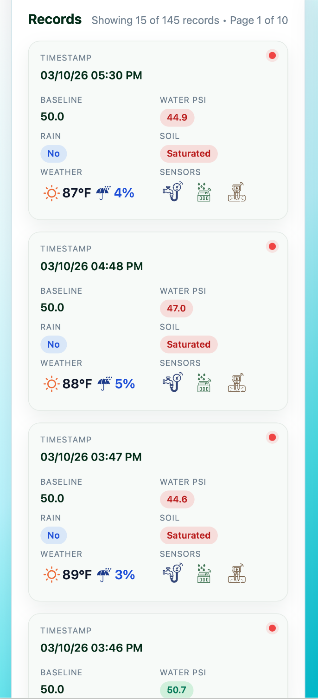
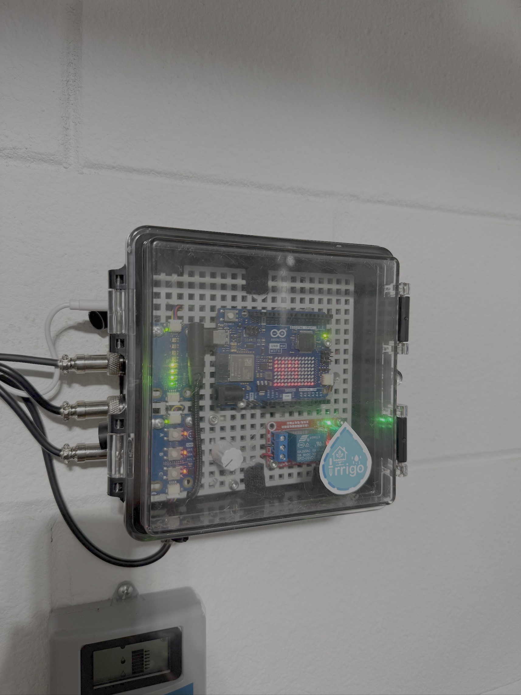
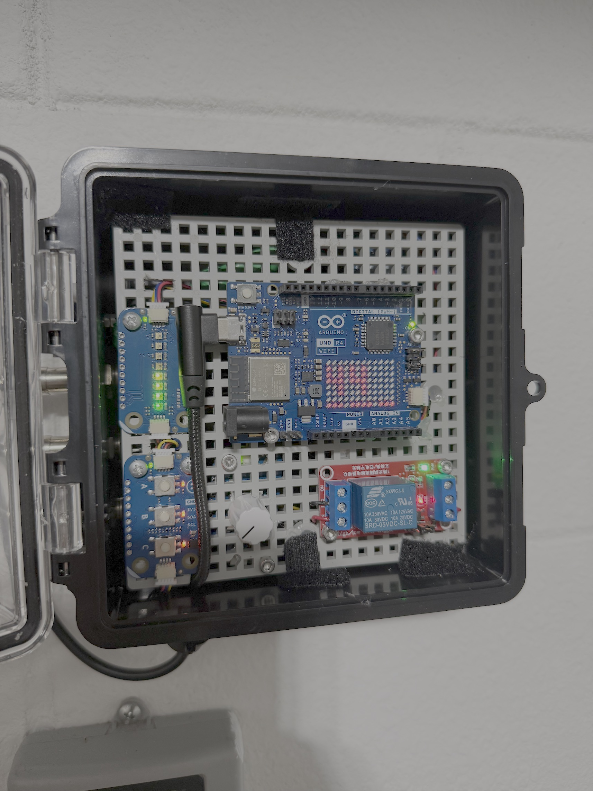
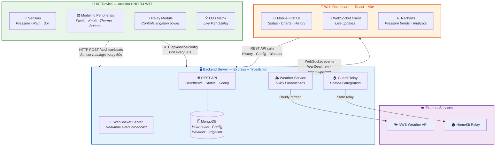
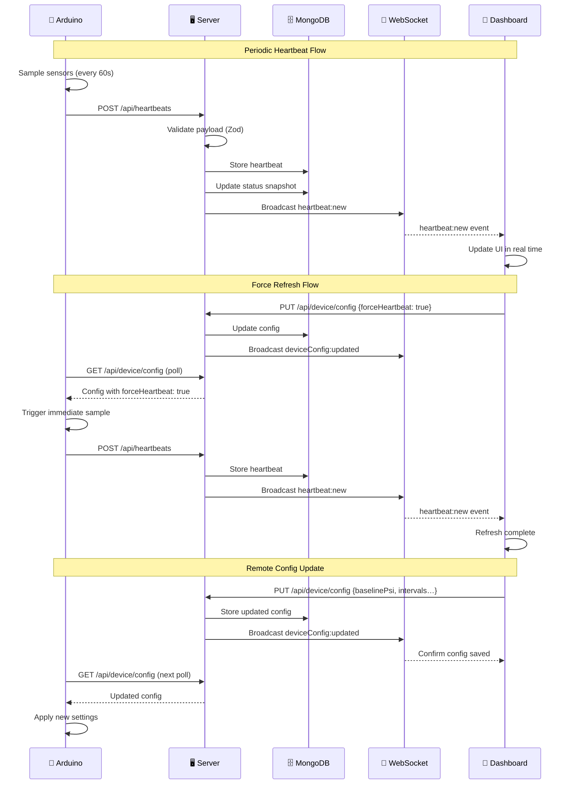

<p align="center">
  
</p>

<h3 align="center">Smart Irrigation Guard System</h3>

<p align="center">
  An IoT-powered lawn monitoring solution that automatically protects your irrigation system<br/>
  by reading water pressure, rain, and soil sensors in real time.
</p>

<p align="center">
  
  
  
  
  
</p>

---

## Overview

**Irrigo** is a full-stack smart irrigation guard that monitors water pressure, rain, and soil moisture through physical sensors connected to an Arduino UNO R4 WiFi. When conditions indicate the lawn doesn't need watering — low pressure in the line, active rain, or saturated soil — a relay automatically signals the irrigation controller to skip the watering cycle.

All sensor data flows to a cloud backend where it's stored in MongoDB, enriched with local weather forecasts, and pushed in real time to a mobile-first React dashboard via WebSocket.

---

## Dashboard

<p align="center">
  
  &nbsp;&nbsp;
  
  &nbsp;&nbsp;
  
</p>

<p align="center">
  <sub>Main status view &nbsp;·&nbsp; Pressure history &amp; guard analytics &nbsp;·&nbsp; Heartbeat records</sub>
</p>

---

## Hardware

<p align="center">
  
  &nbsp;&nbsp;&nbsp;
  
</p>

<p align="center">
  <sub>Weatherproof enclosure (closed) &nbsp;·&nbsp; Internal components (open)</sub>
</p>

The IoT device is built around an **Arduino UNO R4 WiFi** housed in a weatherproof enclosure with:

| Component | Role |
|-----------|------|
| **Pressure transducer** (analog, 0–100 PSI) | Detects irrigation line pressure |
| **Rain sensor** (digital) | Detects active rainfall |
| **Soil moisture sensor** (digital) | Detects ground saturation |
| **5 V relay module** | Cuts power to the irrigation controller |
| **Modulino Pixels** | 8-LED bar showing live PSI level |
| **Modulino Knob** | Adjusts pressure baseline threshold |
| **Modulino Thermo** | Reads ambient temperature & humidity |
| **Modulino Buttons** | Force sample, toggle rain/soil sensors |
| **LED Matrix** (12 × 8) | Displays PSI value and sensor indicators |

---

## Architecture



---

## Real-Time Synchronization



---

## Tech Stack

| Layer | Technology |
|-------|-----------|
| **IoT** | Arduino UNO R4 WiFi · C++ · Modulino peripherals |
| **Backend** | Node.js · Express · TypeScript · Zod validation |
| **Database** | MongoDB 7.0 · Mongoose ODM · TTL indexes |
| **Real-time** | WebSocket (`ws`) · Event-driven broadcast |
| **Frontend** | React 18 · Vite · TypeScript · Recharts |
| **Weather** | NWS Forecast API · Hourly auto-refresh |
| **Infrastructure** | Docker Compose · Nginx reverse proxy |
| **Smart Home** | Optional HomeKit guard relay integration |

---

## Project Structure

```
irrigo/
├── iot/
│   └── sensor_program.cpp        # Arduino firmware (C++)
├── backend/
│   └── src/
│       ├── index.ts               # Server entry point
│       ├── app.ts                 # Express app configuration
│       ├── config/                # Database, weather, persistence config
│       ├── controllers/           # Route handlers
│       ├── models/                # Mongoose schemas
│       ├── routes/                # API route definitions
│       ├── schemas/               # Zod validation schemas
│       └── services/              # Realtime, weather, guard relay, analytics
├── frontend/
│   └── src/
│       ├── App.tsx                # Main application
│       ├── api.ts                 # API client
│       ├── types.ts               # TypeScript definitions
│       ├── hooks/                 # useRealtimeChannel (WebSocket)
│       ├── components/            # UI widgets and sections
│       └── assets/                # SVG icons and illustrations
├── screenshots/                   # App screenshots and hardware photos
├── docker-compose.yml             # Multi-container orchestration
└── README.md
```

---

## Getting Started

### Requirements

- **Node.js** 20+
- **Docker** & Docker Compose (for containerized workflow)
- **Arduino IDE** (for firmware development)

### Environment Configuration

Each workspace uses dedicated environment files:

- **Backend** — copy `backend/.env.example` → `backend/.env.development` and configure `MONGO_URI`, weather gridpoint, and optional guard relay settings.
- **Frontend** — copy the desired template (`frontend/.env.staging.example`, etc.) to `.env.<env>` and set `VITE_API_BASE_URL`.
- **Docker Compose** — the root `.env` controls stack-level toggles (`APP_ENV`, `BACKEND_PORT`, `FRONTEND_PORT`).

### Running with Docker (recommended)

```bash
# Development with bundled MongoDB
docker compose -f docker-compose.yml -f docker-compose.local.yml up --build

# Production
docker compose up --build -d
```

| Service | URL |
|---------|-----|
| Frontend | `http://localhost:${FRONTEND_PORT:-8080}` |
| Backend API | `http://localhost:${BACKEND_PORT:-4000}/api` |
| MongoDB | `localhost:${MONGO_PORT:-27017}` (local profile only) |

### Running with Node

```bash
# Backend
cd backend && npm install
APP_ENV=development npm run dev

# Frontend
cd frontend && npm install
npm run dev -- --mode development
```

### Optional: Guard Relay

Enable the backend to relay guard state changes to a HomeKit-compatible switch:

| Variable | Description |
|----------|-------------|
| `GUARD_RELAY_ENABLED` | Set to `true` to enable |
| `GUARD_RELAY_ENDPOINT` | URL to receive state updates |
| `GUARD_RELAY_ID` | Identifier included in the payload |

---

## API Reference

| Method | Endpoint | Description |
|--------|----------|-------------|
| `POST` | `/api/heartbeats` | Accept device heartbeat payload |
| `GET` | `/api/heartbeats` | Paginated heartbeat history |
| `GET` | `/api/heartbeats/series` | Lightweight PSI time-series |
| `GET` | `/api/heartbeats/overview` | Aggregate guard/sensor statistics |
| `GET` | `/api/status` | Latest heartbeat + summary metadata |
| `GET` | `/api/weather/forecast` | Cached weather forecast + precipitation |
| `GET` | `/api/device/config/:ip` | Device config by IP (Arduino) |
| `PUT` | `/api/device/config/:ip` | Arduino pushes its config |
| `GET` | `/api/device/config` | Fetch latest device config (Dashboard) |
| `PUT` | `/api/device/config` | Update device config (Dashboard) |
| `GET` | `/api/irrigation` | Paginated irrigation events |
| `WS` | `/ws` | Real-time event stream |

Heartbeats older than **90 days** are automatically purged via a MongoDB TTL index.

---

<p align="center">
  <sub>Built with 💧 by Manuel & Claude</sub>
</p>
